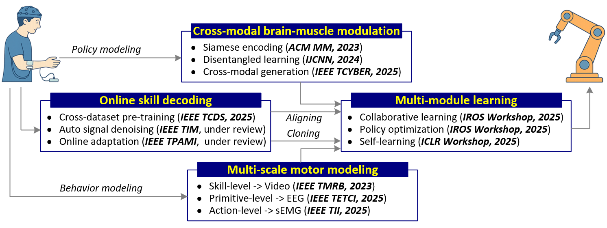



Overall Goal
====

My research focuses on enabling robots to perform and learn manipulation tasks based on humans’ insights. I began by modeling human manipulation behaviors. Building upon these insights, I then explored how robots can learn and transfer such skills through human-inspired learning mechanisms. These efforts are summarized into two main directions: **human manipulation modeling** and **human-machine skill transfer**.

 
 

Stage 1: Human Manipulation Modeling
====
**Problem：** Human manipulation shows a hierarchical structure: high-level brain planning and low-level muscular execution. This structure is implicit within the sensorimotor loop and leads to multi-scale skill representations.

Research 1: Cross-modal brain-muscle modulation:
---
I aligned EEG (brain) and EMG (muscle) into a shared representation space via proxy cross-modal generation and motor classification, enabling quantitative analyses. The derived brain-muscle modulation model provides a measurable account of abstract cortical-muscular control and is consistent with cognitive neuroscience findings (published in IEEE TCYBER, 2025; ACM MM, 2023; invited oral supported by IEEE CIS Travel Grant, IJCNN 2024).

Research 2: Multi-scale motor modeling
---
To reflect the hierarchical structure of manipulation, I built a multi-level model using complementary modalities: video for sequence-level analysis (IEEE TMRB, 2023), EEG for primitive-level decoding (IEEE TETCI, 2025), and EMG for action-level segmentation and rhythm modeling (IEEE TII, 2025). These components collectively capture sequence-primitive-action under a hierarchical perspective.

**Significance**：These efforts turn implicit brain-muscle control into explicit representations and establish a multi-scale structure for skill modeling, preparing for human-robot skill transfer.

 
 

Stage 2: Human–Machine Skill Transfer
====

**Problem：** Transferring human skills to robots requires accurate decoding human skills from limited, low SNR, and variability dataset and an efficient learning model is needed for robots to learn from limited data.

Research 1: Online skill decoding:
---
I designed a skill decoding pipeline (a) performs source-imaging-based cross-electrode alignment to learn stable representations from external datasets; (b) applies task-driven collaborative denoising raw signals; and (c) introduces adaptive alignment spanning data and representation levels, with Bernoulli-hypothesis-based online updates for fast calibration. (Published in IEEE TCDS 2025, ICIA 2025 Best Paper Finalist, and under IEEE TPAMI & IEEE TIM review.)

Research 2: Multi-module learning:
---
Inspired by complementary roles of cerebellum-basal ganglia-cortex, I built a multi-module learning framework:(a) Collaborative imitation (cerebellar, error-driven) for efficient skill transfer under sparse demonstrations; (b) Policy optimization (basal ganglia, reward-driven) for strategy alignment with higher success rates and efficiency; (c) Self-learning (cortical, memory-driven) via generative self-refinement for zero-shot skill acquisition. These ideas have been presented in ICLR Workshop 2025, IROS Workshops 2025, and supported by IEEE CIS Graduate Student Research Grant.

**Significance**：The pipeline couples skill decoding with sample-efficient robot learning, forming the operational basis of bidirectional, collaborative human–robot learning.

 
 

