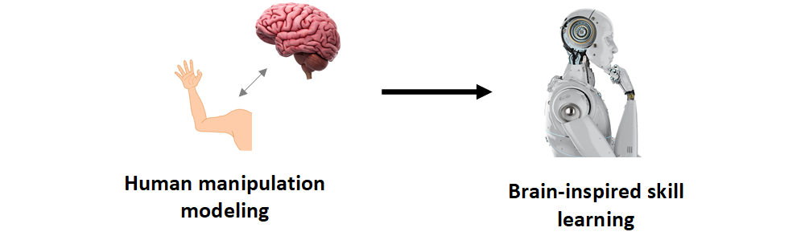
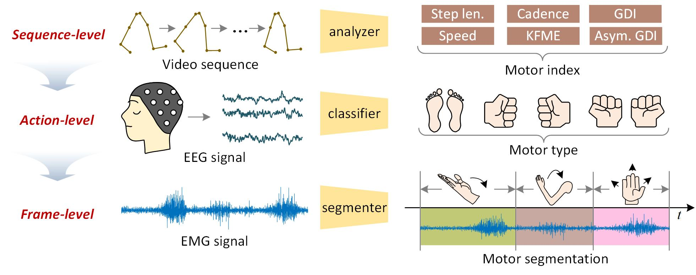
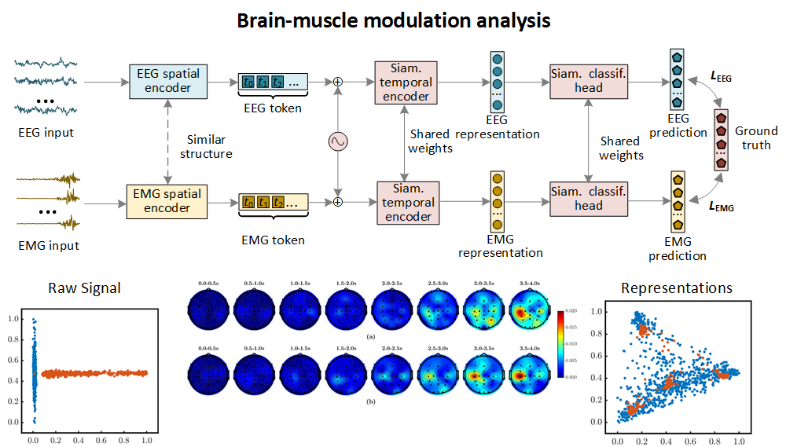



Overall Goal
====

The overall goal of my research is to enable robots to acquire manipulation skills at the human level. To achieve this, we begin by investigating human behavior and exploring the brain’s control mechanisms over muscles during manipulation tasks. Our objective is to translate insights from human experts' manipulation into robotic systems, enabling robots to learn like humans and enhancing their operational capabilities—including improved success rates, broader generalization, and increased dexterity. Specifically, we have structured our research into two stages: first, we strive to explain **how humans perform operations**, and then we address **how robots can learn these skills**. Below is a brief overview of our current progress.

 
 

Stage 1: How humans perform operations.
====

Research 1: Muti-modal Data for Multi-scale Motor Behavior Modeling
---

Human motor skills are characterized by sequences of motor movements governed by the brain’s hierarchical control strategies, which naturally motivates us to model these sequences in a multi-scale manner. In our research, we model motor sequences from coarse to fine by leveraging the unique characteristics of various data modalities to capture motor characteristics at multi-level granularities.

* **Sequence-level** ([IEEE TMRB 2023](https://ieeexplore.ieee.org/abstract/document/10026874) & [IEEE RCAR 2022](https://ieeexplore.ieee.org/abstract/document/9872256)): In these studies, we leverage monocular video sequences to model sequential motor behavior. By exploring both inter-frame constraints and the operator's intrinsic scale constraints, we successfully recover the lost scale information in monocular images. Our approach enables precise analysis of multiple sequence-level motion parameters, achieving correlation coefficients greater than 0.75.

* **Action-level** ([IEEE TETCI 2025](https://ieeexplore.ieee.org/abstract/document/10663067) & [IEEE ROBIO 2022](https://ieeexplore.ieee.org/abstract/document/10011927)): In these studies, we analyze EEG signals derived from both motor imagery and execution. The inherent high noise levels and the gradual formation of features make EEG more suitable for examining action-level behaviors. We investigated a two-stream spatial-temporal network to comprehensively model the spatial-temporal-frequency characteristics of EEG data. By leveraging these features, our approach achieves precise recognition of motor types across multiple datasets.
  
* **Frame-level** (IEEE TII 2025 & [ICONIP 2023](https://link.springer.com/chapter/10.1007/978-981-99-8067-3_30)): To capture finer-grained motor features, these studies explored EMG signals, which measure muscle activity at high frequencies. We re-formulated traditional classification tasks into segmentation tasks, achieving 500 Hz frame-level motor analysis. This high-frequency motor sequencing not only precisely captures motor characteristics but also reflect the unique operational rhythms of different operators.

 
 

Research 2: Analysis of Brain-muscle Modulation
---

In order to analyze brain-muscle modulation during the manipulation, we embedded the representations of brain activities measured by EEG and corresponding muscular responses recorded by EMG into a shared space (**ACM MM 2023; ROBIO 2022**). By analyzing the embedding process, our research can accurately reproduce the brain activities during the execution of different operations. We elaborated on the associations between brain activities and muscle responses in different dimensions, such as temporal, spatial, and temporal-spatial. The conclusions drawn from our analysis align with research in the field of neuroscience.

 
 

Stage 2: How Robots Learn Skills.
====

In the future, we will apply the research results from the first phase to the study of robot skill learning. New work is coming soon!!!
