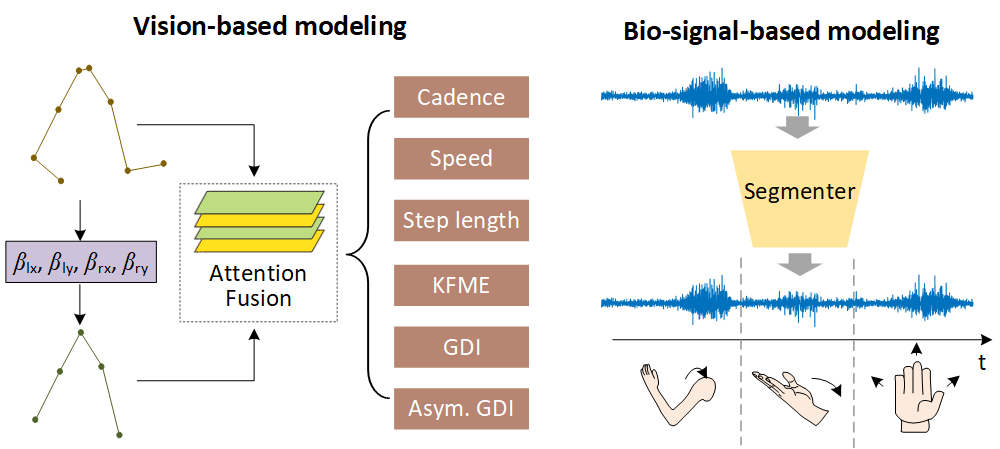



Overall Goal
====

The overall goal of my research is to enable robots to achieve manipulation skills as dexterous as humans. To achieve this goal, we first start with human operational behaviors, exploring the brain's control mechanism over muscles during manipulation. Based on this, we will design robot skill learning algorithms, enabling robots to acquire human-like operational skills. Specifically, our research first aims to explain **how humans perform operations**, and then addresses **how robots learn skills**. So far, my research has mainly focused on the former question. However, we will soon move on to the next phase.

Stage 1: How humans perform operations?
====

Research 1: Sequence Manipulation Modeling
---

Human motor skills are characterized by sequences of motor movements, attributed to the hierarchical control strategy in the brain. Therefore, we model the operator's operational sequence through behavioral data to more accurately reflect human operational behavior. Through a monocular camera (**TMRB 2023; RCAR 2022**) and electrophysiological signals (**ICONIP 2023**), we analyzed the operational behavior of different subjects. This allowed us to extract key parameters of the motor sequences and reflected the unique operational rhythm of different operators during the process.

Research 2: Analysis of Brain-muscle Modulation
---

Stage 2: How Robots Learn Skills?
====

In the future, we will apply the research results from the first phase to the study of robot skill learning. New work is coming soon!!!
