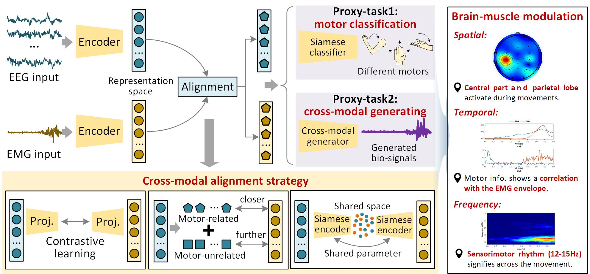
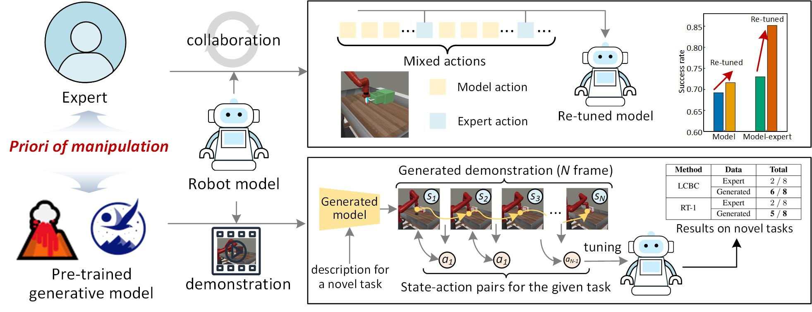



Overall Goal
====

The overall goal of my research is to enable robots to acquire manipulation skills at the human level. To achieve this, we begin by investigating human behavior and exploring the brain’s control mechanisms over muscles during manipulation tasks. Our objective is to translate insights from human experts' manipulation into robotic systems, enabling robots to learn like humans and enhancing their operational capabilities—including improved success rates, broader generalization, and increased dexterity. Specifically, we have structured our research into two stages: first, we strive to explain **how humans perform operations**, and then we address **how robots can learn these skills**. Below is a brief overview of our current progress.

 
 

Stage 1: How humans perform operations.
====

Research 1: Muti-modal Data for Multi-scale Motor Behavior Modeling
---

Human motor skills are characterized by sequences of motor movements governed by the brain’s hierarchical control strategies, which naturally motivates us to model these sequences in a multi-scale manner. In our research, we model motor sequences from coarse to fine by leveraging the unique characteristics of various data modalities to capture motor characteristics at multi-level granularities.

* **Sequence-level** ([IEEE TMRB 2023](https://ieeexplore.ieee.org/abstract/document/10026874) & [IEEE RCAR 2022](https://ieeexplore.ieee.org/abstract/document/9872256)): In these studies, we leverage monocular video sequences to model sequential motor behavior. By exploring both inter-frame constraints and the operator's intrinsic scale constraints, we successfully recover the lost scale information in monocular images. Our approach enables precise analysis of multiple sequence-level motion parameters, achieving correlation coefficients greater than 0.75.

* **Action-level** ([IEEE TETCI 2025](https://ieeexplore.ieee.org/abstract/document/10663067) & [IEEE ROBIO 2022](https://ieeexplore.ieee.org/abstract/document/10011927)): In these studies, we analyze EEG signals derived from both motor imagery and execution. The inherent high noise levels and the gradual formation of features make EEG more suitable for examining action-level behaviors. We investigated a two-stream spatial-temporal network to comprehensively model the spatial-temporal-frequency characteristics of EEG data. By leveraging these features, our approach achieves precise recognition of motor types across multiple datasets.
  
* **Frame-level** (IEEE TII 2025 & [ICONIP 2023](https://link.springer.com/chapter/10.1007/978-981-99-8067-3_30)): To capture finer-grained motor features, these studies explored EMG signals, which measure muscle activity at high frequencies. We re-formulated traditional classification tasks into segmentation tasks, achieving 500 Hz frame-level motor analysis. This high-frequency motor sequencing not only precisely captures motor characteristics but also reflect the unique operational rhythms of different operators.

 
 

Research 2: Cross-modal Alignment for Brain-Muscle Modulation Analyzing
---

To explicitly understand how the brain controls muscle during manipulation, our research aligns the representations of EEG-measured brain activity with the corresponding EMG-recorded muscular responses in a shared space. By analyzing the intrinsic properties of these signals and their impact on downstream tasks, we can quantitatively capture the modulation process between the brain and muscles. We have explored various methods to align these cross-modal signals, including Siamese learning ([ACM MM 2023](https://dl.acm.org/doi/abs/10.1145/3581783.3613794)), disentangled representation learning ([IJCNN 2024](https://ieeexplore.ieee.org/abstract/document/10650264)), and contrastive learning ([IEEE TCYBER 2025](https://ieeexplore.ieee.org/abstract/document/10722863)). 

The downstream proxy tasks we designed validate the effectiveness of our shared representation learning—evidenced by an approximately 4% improvement in relative motor classification accuracy and enhanced fidelity of the cross-modal generated signals (MMD: 0.027; DTW: 20.44). Furthermore, by introducing perturbations to the raw signals and evaluating our trained model’s performance on downstream tasks, we further examine how the brain modulates muscle activity during manipulation. Remarkably, our outcomes align with neuroscience findings across spatial, temporal, and frequency dimensions.

 
 

Stage 2: How Robots Learn Skills.
====

Research 1: Priori Knowledge Transferring for Enhanced Robotic Learning
---

Enhancing the manipulation abilities of robots critically depends on enabling the learning model to acquire the prior knowledge associated with specific tasks. We have investigated two strategies for integrating such prior knowledge:

* **Priori knowledge transfer through interaction with expert** ([Arxiv 2025](https://arxiv.org/abs/2503.04163)): In this study, we directly combine the decisions of human/rule-based experts with those of the robot model, fostering a collaboration that enables the completion of various manipulation tasks. Experimental results indicate that even a small degree of expert-robot integration can significantly increase the success rate of the robot’s learning model. Moreover, the interaction generates operational data that can be used to further fine-tune the model, leading to enhanced performance.

* **Priori knowledge transfer through generated demonstration** ([2025 ICLR WorkShop on GenBot](https://arxiv.org/abs/2412.09286), [Runner Up of IEEE CIS FLAME 2024](https://cis.ieee.org/activities/educational-activites/competitions/flame-technical-challenge-2024-final-submissions)): In this study, we leverage large generative models—including large language models and video generative models—that possess prior understanding of manipulation tasks. Based on natural-language-based descriptions of a task, these models generate corresponding demonstration videos, from which we extract action sequences to form state-action pairs. These pairs are then used to tune the robot model, thereby equipping the robot with the ability to perform new tasks. Validation on models built upon RT1 and LCBC shows that the generated demonstrations can boost the robot's task performance by approximately 40%.

 
 

**In the future, we will continue our research, including—but not limited to—exploring how to enable robots to acquire manipulation skills as efficiently as humans and comparing the learning differences between robots and humans. New works will come soon!!!**

